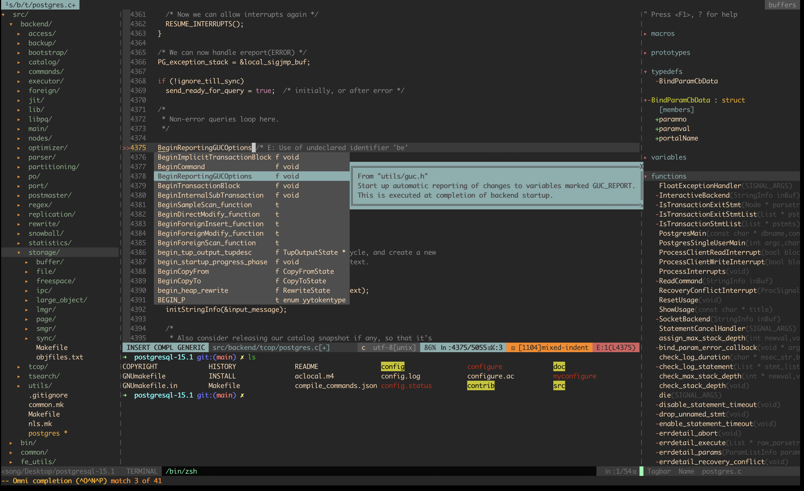

# EasyVim

简单易用的vim配置，熟练后可大大提高开发效率（VS Code的两倍以上）。



## 安装

安装过程需要从github下载很多插件，国内尽量挂VPN

```bash
git clone https://github.com/yuesong-feng/EasyVim
cd EasyVim/
sh ./install.sh 
vim
:PlugInstall
```

tagbar显示和CTRL-]跳转需要安装ctags
C/C++查找相关功能需要安装gtags
强烈推荐将ctags、gtags结合使用，即使用--with-universal-ctags来编译安装gtags。
LSP相关功能需要安装每种语言的LSP服务器，如ccls、clangd等，还需要配置compile_commands.json路径。
开发C/C++时，ctags+gtags和LSP选一种使用即可，也可同时使用，默认都开启了，如果使用卡顿可以禁用LSP相关插件。

**下列快捷键可能随时有变动，以github主页上为准。**

## 模式

| 快捷键            | 原指令                           | 描述
| -----             | -----                            | ----
|                   | ESC或CTRL-[                      | 返回到命令模式
|                   | i                                | 在光标位置插入
|                   | a                                | 在光标后一个位置插入
|                   | I                                | 在行首插入
|                   | A                                | 在行尾插入
|                   | o                                | 在下方新建一行并插入
|                   | O                                | 在上方新建一行并插入
|                   | s                                | 删除光标字符并插入
|                   | S或cc                            | 删除光标所在行并插入
|                   | v                                | 进入可视模式
|                   | V                                | 进入可视行模式，此时会整行选中
|                   | CTRL-V                           | 进入可视块模式，此时会竖行选中，按I进入列插入模式
|                   | R                                | 进入替换模式
|                   | gi                               | 在上一次插入模式的位置插入

## 光标

| 快捷键 | 原指令                     | 描述
| -----  | -----                      | ----
|        | [n]k或j或h或l              | 上下左右移动，前面的n表示移动多少单位
|        | [n]w                       | 右移到下一个单词的开头
|        | [n]e                       | 右移到当前或下一个单词的词尾
|        | [n]b                       | 左移到当前或上一个单词的词头
|        | [n]ge                      | 左移到上一个单词的词尾
|        | [n]W或E或B或gE             | 同上面四行，但单词仅以空格分割，小写则以标点和空格分割
| ;h     | ^                          | 移动到行首第一个非空白字符
| ;l     | $                          | 移动到行尾
|        | 0                          | 移动到行首
|        | [n](或)                    | 向前(后)移动一个(n个)句子(标点符号分割)
|        | [n]{或}                    | 向前(后)移动一个(n个)段落(空行分割)
|        | +或\<enter\>               | 移动到下一行的首个非空字符
|        | -                          | 移动到上一行的首个非空字符
|        | gg或G                      | 移动到文件首(或文件尾)
|        | {n}gg或{n}G或:{n}          | 移动到第n行
|        | {n}%                       | 移动到文件的 n% 处
|        | {n}\|                      | 移动到当前行的第n列
|        | gm                         | 移动到当前行的中间
|        | M或H或L                    | 光标移动到屏幕中间一行/第一行/最后一行
|        | zz或zt或zb                 | 将当前行居中/显示为顶行/显示为底行
|        | [n]zh或[n]zl或z[n]h或z[n]l | 向左(右)滚动一行(n行)
|        | zH或zL                     | 向左(右)滚动半屏
|        | CTRL-E或CTRL-Y             | 向下(上)滚动一行
| ;j或;k | CTRL-D或CTRL-U             | 向下(上)滚动半屏
|        | CTRL-F或CTRL-B             | 向下(上)滚动整屏

## 搜索

| 快捷键 | 原指令     | 描述
| -----  | -----      | ----
|        | [n]f{char} | 移动到行内下一个char字符处，前面加n表示到下n个
|        | [n]F{char} | 移动到行内上一个char字符处，前面加n表示到上n个
|        | [n]t{char} | 移动到行内下一个char字符前，前面加n表示到下n个
|        | [n]T{char} | 移动到行内上一个char字符后，前面加n表示到上n个
|        | ;或,       | 移动到下(上)一个行内搜索的结果(f/F/t/T)，由于;被设置为leader键，按下后要等一秒才会执行跳转
|        | /或?       | 正向(或反向)搜索，输入回车重复上一次搜索
|        | n或N       | 下一个(或上一个)搜索结果
|        | *或#       | 向后(前)搜索当前光标下的单词
|        | gd         | 搜索当前光标下的单词
| ;/     | :noh       | 取消搜索结果高亮
|        | CTRL-P     | 模糊搜索当前目录下的文件


## 编辑

| 快捷键      | 原指令                        | 描述
| -----       | -----                         | ----
|             | u或CTRL-R                     | 撤销(反撤销)
|             | x或X                          | 删除当前(向前删除)字符
|             | [n]r{char}                    | 替换(n个)字符为char
|             | J                             | 删除当前行尾的换行符
| d;l         | D或d$                         | 剪切当前行到行尾
|             | [n]dd                         | 剪切n行，没有n表示剪切一行
|             | [n]yy                         | 复制n行，没有n表示复制当前行
|             | [n]cc                         | 改写n行，没有n表示复制当前行，同S
|             | p                             | 在当前位置后粘贴
|             | P                             | 在当前位置前粘贴
| ;c\<space\> |                               | 注释/反注释当前行或选中内容
| ;w          | :w                            | 保存
| ;q          | :q                            | 退出
|             | c{}或d{}或v{}或y{}            | 更改、删除、选中、拷贝{ }作用域中的内容，作用域在下方表格中

## c,d,v,y命令后的作用域

| 快捷键 | 指令              | 描述
| -----  | -----             | ----
|        | [n]k或j或h或l     | 上下左右，前面的n表示移动多少单位
|        | [n]w              | 到下一个单词的开头
|        | [n]e              | 到当前或下一个单词的词尾
|        | [n]b              | 到当前或上一个单词的词头
|        | [n]ge             | 到上一个单词的词尾
|        | [n]W或E或B或gE    | 同上面四行，但单词仅以空格分割，小写则以标点和空格分割
| ;h     | ^                 | 到行首第一个非空白字符
| ;l     | $                 | 到行尾
|        | 0                 | 到行首
|        | (或)              | 向前(后)一个句子(标点符号分割)
|        | {或}              | 向前(后)一个段落(空行分割)
|        | gg或G             | 移动到文件首(或文件尾)
|        | {n}gg或{n}G或:{n} | 移动到第n行
|        | f{char}或t{char}  | 光标位置到char 之处(之前)
|        | iw                | 整个单词（不包括分隔符）
|        | aw                | 整个单词（包括分隔符）
|        | iW                | 整个空格分割的单词（不包括分隔符）
|        | aW                | 整个空格分割的单词（包括分隔符）
|        | is                | 整个句子（不包括分隔符）
|        | as                | 整个句子（包括分隔符）
|        | ip                | 整个段落（不包括前后空白行）
|        | ap                | 整个段落（包括前后空白行）
|        | ib或i)或i(        | 小括号内
|        | ab或a)或a(        | 小括号内（包含小括号本身）
|        | iB或i}或i{        | 大括号内
|        | aB或a}或a{        | 大括号内（包含大括号本身）
|        | i]或i[            | 中括号内
|        | a]或a[            | 中括号内（包含中括号本身）
|        | i'                | 单引号内
|        | a'                | 单引号内（包含单引号本身）
|        | i"                | 双引号内
|        | a"                | 双引号内（包含双引号本身）
|        | [n]i)             | 往外n层小括号内
|        | [n]a)             | 往外n层小括号内（包含小括号本身）
|        | [n]f)             | 到第n个小括号处
|        | [n]t)             | 到第n个小括号前

## 窗口与跳转

| 快捷键            | 指令             | 描述
| -----             | -----            | ----
|                   | CTRL-O或CTRL-I   | 返回光标上一个/下一个所在位置
| ;n                | :NERDTreeToggle  | 打开目录
| ;m                | :TagbarToggle    | 打开tag列表
| ;[1-9]            |                  | 转到第n个buffer
| ;bd               | :bd              | 关闭当前buffer
| ;bn               | :bn              | 下一个buffer
| ;bp               | :bp              | 上一个buffer
|                   | gt               | 跳转到下一个tab
|                   | gT               | 跳转到上一个tab
| ;t                | :terminal        | 打开新终端，在终端中使用CTRL-W使用vim窗口控制
| CTRL {h或j或k或l} | CTRL-W {h/j/k/l} | 在多个窗口跳转
|                   | CTRL-W {H/J/K/L} | 将当前窗口移动到某一方向
|                   | CTRL-W o         | 仅保留当前窗口，关闭其他所有窗口
|                   | CTRL-W =         | 将所有窗口的高度宽度设置为与当前窗口一样
|                   | CTRL-W [n]+或-   | 增加或减少[n]单位的当前窗口高度
|                   | CTRL-W _         | 将当前窗口的高度设置为尽可能最高
|                   | CTRL-W [n]<或>   | 增加或减少[n]单位的当前窗口宽度
|                   | CTRL-W \|        | 将当前窗口的宽度设置为尽可能最宽

## C/C++开发、gtags

| 快捷键 | 原指令 | 描述
| -----  | -----  | ----
|        | CTRL-] | 跳转到定义，需要ctag生成tags文件
|        | gf     | 跳转到头文件，找不到则需要在.vimrc中设置path
| ;gs    |        | Find this symbol
| ;gg    |        | Find this definition
| ;gd    |        | Find functions called by this function
| ;gc    |        | Find functions calling this function
| ;gt    |        | Find this text string
| ;ge    |        | Find this egrep pattern
| ;gf    |        | Find this file
| ;gi    |        | Find files #including this file
| ;ga    |        | Find places where this symbol is assigned a value
| ;gz    |        | Find current word in ctags database

## C/C++、LSP、代码提示补全等

| 快捷键 | 原指令             | 描述
| -----  | -----              | ----
| ;ag    | :ALEGoToDefinition | 跳转到定义
| ;af    | :ALEFindReferences | 查找引用
| ;as    | :ALESymbolSearch   | 查找系统符号
| ;ah    | :ALEHover          | 显示详细信息
| ;ar    | :ALERename         | 重命名
| ;aa    | :ALECodeAction     | 代码自动优化

## rust

| 快捷键 | 原指令   | 描述
| -----  | -----    | ----
| ;rf    | :RustFmt | 代码格式化
| ;rr    | :RustRun | 运行rust代码

