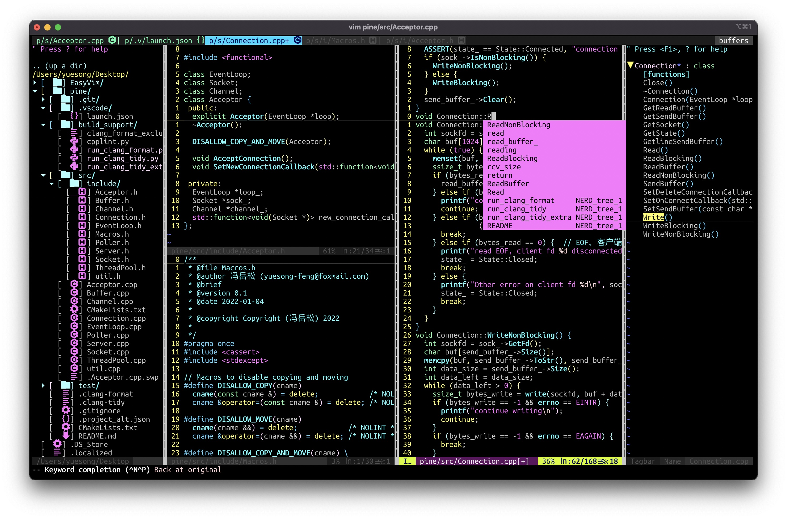

# EasyVim
简单易用的vim配置，熟练后可大大提高开发效率（VS Code的两倍以上）。

配置还在不断打磨完善，欢迎推荐插件。

## example


## 安装
```bash
git clone https://github.com/yuesong-feng/EasyVim
cd EasyVim/
sh ./install.sh
vim
:PlugInstall
```
需要安装[ctags](http://ctags.sourceforge.net)，才可以使用taglist插件寻找函数、宏、类等等的位置（上图右侧栏）。

需要安装任意一款[nerd](https://github.com/ryanoasis/nerd-fonts)字体，才可以看到好看的图标。推荐使用Ubuntu Mono Nerd Font

需要安装clangd，才能使用C++代码补全。

今后将会写在install.sh脚本里。

## 模式
| 快捷键 | 原指令 | 描述
| ----- | ----- | ----  
||esc|返回到命令模式
||i|在光标位置插入
||a|在光标后一个位置插入
||I|在行首插入
||A|在行尾插入
||o|在下方新建一行并插入
||O|在上方新建一行并插入
||s|删除光标字符并插入
||S|删除光标所在行并插入
||v|进入可视模式
||V|进入可视行模式，此时会整行选中
||control v|进入可视块模式，此时会竖行部分选中
|完善中|完善中|完善中

## 光标与搜索(也可在可视模式进行选中)
| 快捷键 | 原指令 | 描述
| ----- | ----- | ----  
||(number) k或j或h或l|上下左右移动光标，前面加数字表示移动多少单位
||f (char)|光标移动到行内下一个char字符处
||F (char)|光标移动到行内上一个char字符处
|;h或;l|^或$|光标移动到行首(或行尾)
|;k或;j|gg或G|光标移动到文件首(或文件尾)
||control e或y|向下(上)滚动一行
||control f或b|向下(上)滚动整屏
||control d或u|向下(上)滚动半屏
||/或?|正向(或反向)搜索，按n下一个，N上一个
|;enter|:noh|取消搜索结果高亮
|;f|control p|模糊搜索文件
|完善中|完善中|完善中

## 编辑
| 快捷键 | 原指令 | 描述
| ----- | ----- | ----  
||u|撤销
||control r|反撤销
||(number) dd|剪切number行，没有number表示剪切一行
||视图模式 d|剪切选中区域
||D|剪切当前行到行尾
||(number) yy|复制number行，没有number表示复制当前行
||视图模式 y|复制选中区域
||p|在当前行后粘贴
||P|在当前行前粘贴
|control x|:m +1|将当前行向下移动
|control s|:m -2|将当前行向上移动
|;w|:w|保存
|;q|:q|退出
|完善中|完善中|完善中

## 窗口与跳转
| 快捷键 | 原指令 | 描述
| ----- | ----- | ----  
||gf|打开光标处的文件，.vimrc的path为搜索路径
||control o|返回上一个文件
|;n|:NERDTreeToggle|打开目录
|;m|:TlistToggle|打开函数目录（需要安装ctags）
|;bn|:bn|跳转到下一个buffer
|;bp|:bp|跳转到上一个buffer
|;bf|:buffers && :b number|查看打开过的buffer并跳转，不输入数字直接按回车不跳转
|control (h或j或k或l)|control W (hjkl)|在多个窗口跳转
||gt|跳转到下一个tab
||gT|跳转到上一个tab
|;a|:A|C/C++头(源)文件相互跳转，.vimrc中的g:alternateSearchPath为搜索路径
|;t|:shell|打开新终端，退出终端时将放回vim
||control o|返回光标上一个所在位置
|完善中|完善中|完善中

## 已安装插件
在`.vimrc`文件的注释中，有官网链接和配置
